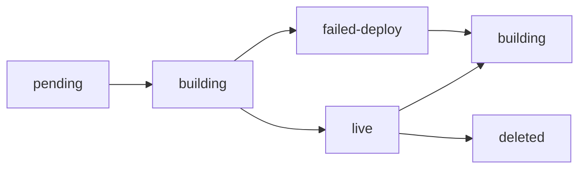

DeployHub provides a fully automated deployment pipeline that transforms your GitHub repository into a live application. The system handles everything from code cloning to Docker containerization and deployment.

## Deployment Workflow

When you create a deployment, DeployHub orchestrates a multi-stage process:

<Steps>
  <Step title="Project Creation">
    Your project is created with status `pending` and assigned a unique subdomain (e.g., `myapp-a8c7d2`).
  </Step>
  
  <Step title="Build Queue">
    The project is added to the BullMQ build queue for processing by a dedicated build worker.
  </Step>
  
  <Step title="Repository Cloning">
    Build worker clones your repository using GitHub access tokens (if authenticated) or public access.
  </Step>
  
  <Step title="Docker Build">
    Application is containerized using project-type-specific Dockerfiles with your build configuration.
  </Step>
  
  <Step title="Image Push">
    Docker image is pushed to Docker Hub registry for deployment.
  </Step>
  
  <Step title="Container Deployment">
    Deploy worker creates and starts a container on the `users` network with your environment variables.
  </Step>
</Steps>

## Supported Project Types

### Static Sites

Static sites (React, Vue, Vite, etc.) are built and served with Nginx.

**Build Process:**
```javascript
// From buildworker.js:86-107
const dynamicBuildArgs = {
  BUILD_CMD: projectdata.buildCommand || "",
  BUILD_DIR: projectdata.publishDir,
  VITE_ENV_CONTENT: viteEnvContent
};

const tarStream = await docker.buildImage(tarStreamPack, {
  t: imageName,
  dockerfile: "Dockerfile",
  nocache: true,
  buildargs: dynamicBuildArgs,
});
```

**Dockerfile Template:**
```dockerfile
FROM node:20.19.5 AS build
WORKDIR /app
COPY package*.json ./
RUN npm ci
COPY . .

ARG BUILD_CMD
ARG BUILD_DIR=build
ARG VITE_ENV_CONTENT

RUN echo "$VITE_ENV_CONTENT" > .env
RUN if [ -n "$BUILD_CMD" ]; then sh -c "$BUILD_CMD"; else npm run build; fi

FROM nginx:alpine
COPY nginx.conf /etc/nginx/conf.d/default.conf
COPY --from=build /app/${BUILD_DIR} /usr/share/nginx/html
EXPOSE 80
CMD ["nginx", "-g", "daemon off;"]
```

<Info>Static sites are served on port 80 and automatically configured with Nginx for optimal performance.</Info>

### Node.js Applications

Node.js applications are containerized with your custom start command and port configuration.

**Build Process:**
```javascript
// From buildworker.js:123-149
const tarStream = await docker.buildImage(tarStreamPack, {
  t: `${imageName}`,
  dockerfile: "Dockerfile",
  nocache: true,
  buildargs: {
    APP_PORT: stringify(projectdata.port),
    START_CMD: projectdata.startCommand,
  },
});
```

**Dockerfile Template:**
```dockerfile
FROM node:20-alpine AS builder
WORKDIR /app
COPY package*.json ./
RUN npm ci --omit=dev
COPY . .

FROM node:20-alpine
WORKDIR /app
COPY --from=builder /app /app

ARG APP_PORT=3000
ENV PORT=$APP_PORT
EXPOSE $APP_PORT

ARG START_CMD="node index.js"
ENV START_CMD=$START_CMD
CMD ["sh", "-c", "$START_CMD"]
```

## Monorepo & Folder Support

DeployHub supports deploying specific folders from monorepos using Git sparse-checkout:

```javascript
// From buildworker.js:199-217
if (isFolder === true) {
  execSync(
    `git clone -b ${branchname} --filter=blob:none --sparse ${repoUrlWithAuth} ${buildFilePath}`,
    { stdio: "inherit" },
  );
  execSync(`git -C ${buildFilePath} sparse-checkout set ${folderName}`, {
    stdio: "inherit",
  });
  
  // Move folder contents to root
  const folderPath = path.join(buildFilePath, folderName);
  const entries = await fs.promises.readdir(folderPath, { withFileTypes: true });
  for (const entry of entries) {
    await fs.promises.cp(src, dest, { recursive: true, force: true });
  }
}
```

<Tip>Enable folder deployment in project settings to deploy a specific subdirectory from your repository.</Tip>

## Build Worker Architecture

Builds are processed by BullMQ workers with concurrency control:

```javascript
// From buildworker.js:14-256
const buildWorker = new Worker(
  "buildqueue",
  async (job) => {
    const { projectId, buildId } = job.data;
    // Build process...
  },
  {
    connection: connection,
    concurrency: 1,  // Sequential processing
  }
);
```

**Worker Events:**

- `active` - Build starts processing
- `completed` - Build succeeds, triggers deployment queue
- `failed` - Build fails, updates project status to `failed-deploy`

## Deployment Worker

After successful builds, the deployment worker creates and starts containers:

```javascript
// From deployworker.js:38-48 (Static)
const container = await docker.createContainer({
  Image: imageName,
  name: `${bindingData.subdomain}`,
  Env: envVariables,
  HostConfig: {
    NetworkMode: "users"
  }
});

await container.start();
```

<Info>All containers run on the `users` Docker network for isolation and routing through the reverse proxy.</Info>

## Redis Caching

Subdomain-to-project mappings are cached in Redis for fast routing:

```javascript
// From createDeployment.controller.js:194-199
await redisclient.hset(`subdomain:${allocation.subdomain}`, {
  port: allocation.port,
  projectId: newProject._id.toString(),
  plan: newProject.plan
});
```

## Automatic Redeployment

DeployHub intelligently handles redeployments by checking commit history:

```javascript
// From reDeploy.worker.js:70-74
const isBuildFailed = buildData.status === "failed";
const isNewCommit = commitSha && buildData.commitSha !== commitSha;

if (isBuildFailed || isNewCommit) {
  // Rebuild from scratch
}
```

**Redeployment triggers a rebuild when:**
- Previous build failed
- New commit detected on the branch
- Otherwise, existing Docker image is reused

## Build Cleanup

Build artifacts are automatically cleaned up after processing:

```javascript
// From buildworker.js:245-250
finally {
  const buildFilePath = path.join("builds", job.data.buildId.toString());
  if (fs.existsSync(buildFilePath)) {
    fs.rmSync(buildFilePath, { recursive: true, force: true });
  }
}
```

## Project Status Flow



**Status States:**
- `pending` - Project created, awaiting configuration
- `building` - Build or deployment in progress
- `live` - Application running and accessible
- `failed-deploy` - Build or deployment failed
- `deleted` - Project marked for deletion

## API Reference

### Create Deployment

```javascript
POST /api/deployment/create

{
  "projectId": "507f1f77bcf86cd799439011",
  "name": "my-app",
  "codeLink": "https://github.com/user/repo.git",
  "projectType": "static",
  "buildCommand": "npm run build",
  "publishDir": "dist",
  "branchname": "main",
  "isFolder": false,
  "env": {
    "VITE_API_URL": "https://api.example.com"
  }
}
```

<Warning>The `buildCommand` and `publishDir` are required for static projects. The `startCommand` and `port` are required for Node.js projects.</Warning>

### Response

```json
{
  "success": true,
  "buildId": "507f1f77bcf86cd799439022",
  "status": "queued",
  "newProject": {
    "_id": "507f1f77bcf86cd799439011",
    "name": "my-app",
    "subdomain": "my-app-a8c7d2",
    "status": "building"
  }
}
```